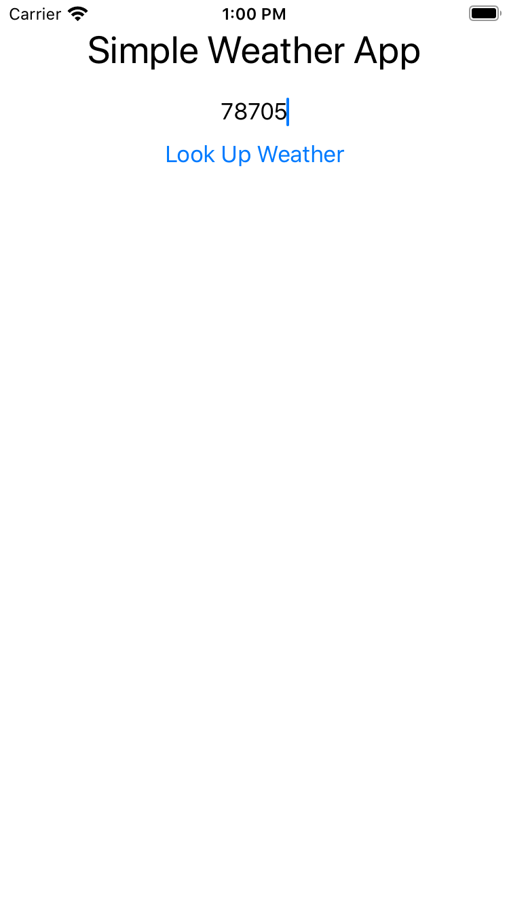
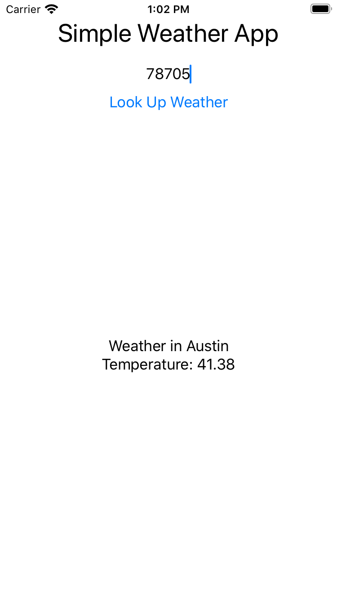

# Simple Weather App
### An iOS Application

This is a simple weather app that displays city name and current temperature based on a zipcode input.

### API
OpenWeatherApp: See API docs here: https://openweathermap.org/current

### Motivations

This was a personal, self-taught introduction project to iOS app development and Swift.
As an Apple user, I am highly interested in application development and wanted to expand my technical skillset.

